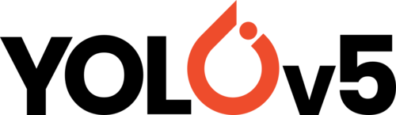

# [YOLOv5](https://ultralytics.com/yolov5) by [Ultralytics](https://ultralytics.com)

<div align="center">
<p>

</p>
<br>
<div>
<a href="https://github.com/ultralytics/yolov5/actions"></a>
<a href="https://zenodo.org/badge/latestdoi/264818686"></a>
<br>  
<a href="https://colab.research.google.com/github/ultralytics/yolov5/blob/master/tutorial.ipynb"></a>
<a href="https://www.kaggle.com/ultralytics/yolov5"></a>
<a href="https://hub.docker.com/r/ultralytics/yolov5"></a>
</div>

<br>
<p>
YOLOv5 is a family of object detection architectures and models pretrained on the COCO dataset.
</p>
</div>  

*Note : YOLOv5 is current **under active development**, all code, models, and documentation are subject to modification or deletion without notice. __Use at your own risk.__*

## <div align="center">Documentation</div>
* [Full Documentation](https://docs.ultralytics.com)

## <div align="center">Quick Start Tutorials</div>
These tutorials are intended to get you started using YOLOv5 quickly for demonstration purposes. Head to the Full Documentation](https://docs.ultralytics.com) for more indept tutorials
<details>
<summary>
Install Locally
</summary>

```bash
# Clone into current directory
$ git clone git@github.com:ultralytics/yolov5.git .
# Install requirements
$ pip install -r requirements.txt
```

</details>
<details>
<summary>Inference Using Repository Clone</summary>

*NOTE : In order to follow this tutorial please ensure you have installed YOLOv5 locally.*  

```bash
# Run inference based on selected input
$ python detect.py --source 0  # webcam
                            file.jpg  # image 
                            file.mp4  # video
                            path/  # directory
                            path/*.jpg  # glob
                            'https://youtu.be/NUsoVlDFqZg'  # YouTube video
                            'rtsp://example.com/media.mp4'  # RTSP, RTMP, HTTP stream
```

</details>
<details>
<summary>Inference Using PyTorch Hub</summary>

This tutorial will automatically download YOLOv5 to your local system before running inference on the supplied image.  

```python
import torch

# Define your model, options include yolov5s, yolov5m, yolov5l, yolov5x
model = torch.hub.load('ultralytics/yolov5', 'yolov5s')

# Define your image
img = 'https://ultralytics.com/images/zidane.jpg'

# Run inference
results = model(img)

# Handle your results, options include .print(), .show(), .save(), .panadas().xyz()
results.print()
```

</details>

<details>
<summary>Training</summary>

*NOTE : In order to follow this tutorial please ensure you have installed YOLOv5 locally.*  

```bash
$ python train.py --data coco.yaml --cfg yolov5s.yaml --weights '' --batch-size 64
                                         yolov5m                                40
                                         yolov5l                                24
                                         yolov5x                                16

```

</details>

## <div align="center">Why YOLOv5</div>
test

## <div align="center">Getting Involved</div>

Issues should be raised directly in the repository.

## <div align="center">Get in Touch</div>

For business or professional support requests please visit [https://ultralytics.com/contact](https://ultralytics.com/contact)